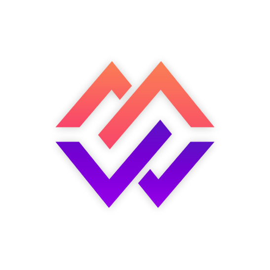

## Senior Developer | Flutter | Firebase | Node Js | Full-Stack | Development Manager | Technical Consultant | Business Developer | 5+ Yrs of Experience

🏆 Full Stack Developer | Development Manager | Business Developer | Technical Consultant 🏆

🌟 Responsive communication✔️
🌟 Intuitive and unique custom solutions✔️
🌟 Post-development maintenance✔️

Seeking an experienced professional to bring your mobile app concepts to life? Your search ends with me! I've successfully worked with over 30+ mobile apps. which have more than 500,000+ Download on Google Play Store & App Store Combined. Developed all of them from scratch & helped my clients grow those apps.

Over the past years, I've gained expertise in developing, launching & growing applications with App Store Optimizations & App Install Campaigns. My specialization lies in creating innovative solutions that consistently exceed expectations & I’m a Growth Hacker for my clients. I excel in mobile app development using Flutter & Digital Marketing Campaigns.

## 💰🚀Most Famous Apps:

🌟MingleWise - Dating | Networking | Events

✅ Live on Play Store & App Store
✅ 200,000+ Download
✅ 20,000+ Monthly Active Users

&nbsp;&nbsp;

&nbsp;&nbsp;

 
 

🌟Property Dictionary

✅ Live on Play Store & App Store
✅ 10,000+ Download
✅ 1,000+ Monthly Leads For Real Estate Developer

&nbsp;&nbsp;

&nbsp;&nbsp;

 
 

🌟Sales Management CRM

✅ Used By 50+ Clients Across The Globe
✅ Customized White Label Management Solution
✅ Yearly Subscription

## ★ Tech-Stacks

&nbsp;&nbsp;

&nbsp;&nbsp;

&nbsp;&nbsp;

&nbsp;&nbsp;

&nbsp;&nbsp;

&nbsp;&nbsp;

&nbsp;&nbsp;

&nbsp;&nbsp;

&nbsp;&nbsp;

&nbsp;&nbsp;

&nbsp;&nbsp;

&nbsp;&nbsp;

&nbsp;&nbsp;

&nbsp;&nbsp;

&nbsp;&nbsp;

&nbsp;&nbsp;

&nbsp;&nbsp;

&nbsp;&nbsp;

&nbsp;&nbsp;

&nbsp;&nbsp;

&nbsp;&nbsp;

## ★ Skills:

✅5+ years of experience in Software Development
✅Proven track record of tackling app store & play store rejections
✅Proficiency in Dart programming language & the foundation of Flutter
✅Developed high-quality cross-platform mobile apps for Android and iOS using Flutter.
✅Developed robust unit tests and set up CI/CD pipelines for automation.
✅Strong communication and problem-solving skills, effective collaboration and issue resolution.
✅Proven track record of delivering high-quality, performance-driven mobile applications for diverse industries.
✅Managed a team of 20+ Developers, Designers & Business Analyst
✅Experience in Giving Presentations & Demos on client calls.
✅Demonstrated skills in analysis & shared ideas on how to grow apps.
✅Hands on Experience with Meta & Google Ads for Apps & Websites.
✅Direct involvement in decision making with the Managers, CEO & Founders of different companies & apps.

## ★ Types of Applications:

🌟 Social Apps
✅ Dating
✅ Traveling
✅ Networking
✅ Matching
✅ Posting & Feed

🌟 CRM & Management Platforms
✅ Sales
✅ Tasks
✅ Reporting

🌟 Booking & Lead Generation
✅ Service Booking & Leads Generation
✅ Venue Booking
✅ Appointment Booking
✅ Selling & Lead Generation

## ★ Why Choose Me For Your Project ?

✔ Proof of work with live projects
✔ Client satisfaction is my first priority
✔ Professional and aesthetically pleasing UI and app design
✔ Experience in working with a team of developers
✔ Commitment to delivering clean, maintainable, and well-documented code.

## ★ Expertise in :

✔️ Flutter Mobile and Web App Development
✔️ Next Js Website Development
✔️ Business Analysis
✔️ API Development & Integration
✔️ Payment Gateway integration : Stripe, Paytm, RazorPay, PayU
✔️ In-App Purchases With RevenueCat, Google, Apple Pay or any other 3rd party banking api
✔️ Video Implementation Live Video/Audio Streaming - Agora.IO
✔️ Advertisement - Google Ads / Meta Ads
✔️ Database - No-SQL, SQL, PostgreSQL, SQLite, Hive
✔️ Backend - Firebase, Supabase, AWS, GCP, Docker
✔️ Tracking - Google Maps, Geo Location

I use the following tools and methods during the development process:
🌟 Git/Bitbucket-Version Control
🌟 Agile/Scrum - Development model
🌟 Notion/Azure - Task Management

## Founded Hv Technologies At 18 - Software Development Consultancy

## Wanna Learn Coding / Development? Visit Smart Coding Classes

## Find Me

&nbsp;&nbsp;

&nbsp;&nbsp;

&nbsp;&nbsp;

&nbsp;&nbsp;

&nbsp;&nbsp;

## Hire Me As A Freelancer

&nbsp;&nbsp;

## Support Me

&nbsp;&nbsp;

